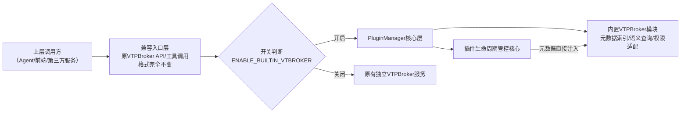

# PluginManager + VTPBroker 整合落地方案 v1.0
**适用版本**：VCP ≥ 2.0
**总开发周期**：8人日
**核心原则**：100%生态兼容、无破坏性变更、开关可控、风险可回滚

---
## 一、核心架构设计
### 1. 整体分层（完全保留职责边界）

### 2. 设计约束
1. **PluginManager核心逻辑零修改**：仅新增内置模块，不改动原有插件加载、沙箱、权限等核心逻辑
2. **对外接口100%兼容**：所有原VTPBroker的HTTP API、Agent工具调用格式完全不变，上层无任何适配成本
3. **开关可控**：新增配置项`ENABLE_BUILTIN_VTBROKER=true/false`，可随时切换架构模式

---
## 二、分阶段落地执行指南
### 阶段1：内置VTPBroker模块开发（3人日）
#### 执行步骤：
1. **代码移植**：将`modules/vtbroker`下的核心逻辑（索引构建、语义匹配算法、API路由）移植到`PluginManager/src/modules/builtin_vtbroker`目录下，去掉跨进程通信、缓存同步、事件订阅等冗余逻辑
2. **钩子对接**：在PluginManager的`pluginLoadSuccess`/`pluginUnload`/`pluginUpdate`三个核心钩子中，新增元数据同步逻辑：
   - 插件加载成功后，直接将合法的`plugin-manifest.json`元数据注入内置索引
   - 插件卸载/更新时，自动同步更新内置索引
3. **配置新增**：在PluginManager的`config.env`中新增配置项：
   ```env
   # 是否启用内置VTPBroker模块
   ENABLE_BUILTIN_VTBROKER=false
   # 内置VTPBroker API监听端口（默认和原独立服务端口一致，无缝切换）
   BUILTIN_VTBROKER_PORT=8099
   ```
4. **API兼容**：在PluginManager的HTTP服务中新增原VTPBroker的所有API路由，返回结构完全和旧版一致
#### 验收标准：
- 开关打开后，调用`http://127.0.0.1:8099/vtbroker/api/list_tools`返回结果和原独立VTPBroker完全一致
- 插件热重载后，元数据零延迟生效，索引构建耗时<100ms

### 阶段2：适配层兼容改造（2人日）
#### 执行步骤：
1. **修改适配插件**：更新`Plugin/vtbroker`下的代码逻辑：
   - 优先读取`ENABLE_BUILTIN_VTBROKER`配置，开启时直接调用内置模块的本地接口
   - 关闭时回退到原有的HTTP调用逻辑，兼容独立部署模式
2. **返回结构对齐**：两种模式下的返回结构完全一致，上层调用方无感知
#### 验收标准：
- Agent原有的`vtbroker_list_tools`/`vtbroker_get_tool_schema`工具调用完全正常，无需修改任何系统提示词
- 切换开关时，所有调用无任何报错，返回结果一致

### 阶段3：增强能力开发（2人日）
#### 执行步骤：
1. **权限感知查询**：内置VTPBroker模块对接PluginManager的权限系统，查询工具时自动过滤当前请求方无权限的工具，减少无效返回
2. **异常插件过滤**：自动过滤加载失败、已禁用、离线的插件，避免返回不可用工具，降低调用报错率
3. **Swarm原生适配**：给`modules/swarm/task-decomposer`暴露原生元数据查询接口，无需走HTTP调用，Swarm任务拆解效率提升20%+
#### 验收标准：
- 无权限的插件不会出现在工具查询结果中
- 加载失败的插件自动被过滤，不会返回给调用方
- Swarm任务拆解时工具查询耗时从平均200ms降到<10ms

### 阶段4：灰度上线与验证（1人日）
#### 执行步骤：
1. **全量回归测试**：覆盖所有插件调用、VTPBroker API、Agent工具查询场景，确认无兼容性问题
2. **默认配置**：开关默认关闭，用户可根据需求手动开启
3. **文档更新**：更新VCP官方文档，说明内置VTPBroker的开启方式、适用场景
#### 验收标准：
- 全量测试用例通过率100%
- 开启内置模块后，原有所有业务逻辑无任何异常

---
## 三、兼容与回滚保障
### 1. 兼容保障
- 所有原VTPBroker的API、工具调用格式100%兼容，上层调用方无需任何修改
- 独立VTPBroker服务可继续运行，开关关闭时完全回到原有架构，无任何业务影响
- 所有现有插件无需任何修改即可正常运行

### 2. 回滚方案
若内置模块出现任何问题，仅需两步即可完全回滚到原有架构：
1. 修改PluginManager配置`ENABLE_BUILTIN_VTBROKER=false`
2. 重启PluginManager服务，恢复原独立VTPBroker调用链路，零业务损失

---
## 四、测试用例清单
| 测试类型 | 测试用例 | 预期结果 |
| --- | --- | --- |
| 功能测试 | 调用`vtbroker_list_tools all` | 返回所有已加载的合法插件列表，和独立部署结果一致 |
| 功能测试 | 调用`vtbroker_get_tool_schema <tool_id>` | 返回正确的工具调用格式，和独立部署结果一致 |
| 功能测试 | 热重载一个插件 | 元数据立即更新，无需等待索引构建 |
| 功能测试 | 禁用一个插件 | 该插件自动从查询结果中消失 |
| 兼容测试 | Agent使用原VTPBroker调用格式查询工具 | 完全正常返回，无报错 |
| 兼容测试 | 切换`ENABLE_BUILTIN_VTBROKER`开关 | 所有调用无异常，返回结果一致 |
| 性能测试 | 连续100次调用工具查询接口 | 平均响应时间<10ms，无超时 |
| 性能测试 | 加载100个插件 | 索引构建耗时<100ms |

---
## 五、上线后操作指南
1. 开启内置VTPBroker：修改PluginManager的`config.env`中`ENABLE_BUILTIN_VTBROKER=true`，重启服务即可
2. 验证是否生效：调用`http://127.0.0.1:8099/vtbroker/api/status`，返回`{"mode":"builtin","status":"ok"}`即为生效
3. 可选优化：开启内置模块后，可停止原独立VTPBroker服务，删除`modules/vtbroker`目录（如需保留独立部署能力可保留）