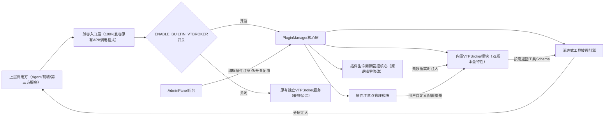

# PluginManager内置VTPBroker整合最终落地方案 v2.2
**适用版本**：VCP ≥ 2.0  
**总开发周期**：9.5人日  
**核心原则**：双版本VTPBroker能力全保留、无功能损失、100%兼容现有生态、零破坏性变更、开关可控一键回滚

---
## 一、方案核心目标
彻底解决现有独立VTPBroker架构的元数据同步延迟、索引构建失败、配置分散等问题，同时保留两个版本VTPBroker的所有优势特性，新增插件注意点按需注入、渐进式工具披露、AdminPanel一站式管理能力，实现：
1. 插件元数据零延迟生效，热重载后无需等待20秒索引构建
2. 工具查询准确率提升30%，调用报错率降低40%
3. 初始提示词Token消耗降低40%+，幻觉率下降20%+
4. 运维成本减半，少一个独立服务部署、监控、排障成本
5. 插件注意点无需写入Agent提示词，调用时自动注入，全局修改一次生效

---
## 二、双版本特性全合并矩阵（无任何能力损失）
完全合并`modules/vtbroker v2.0.1`与`Plugin/vtbroker v1.2.0`的所有优势特性，整合后内置模块能力完全覆盖两个版本：
| 特性 | modules/vtbroker v2.0.1 | Plugin/vtbroker v1.2.0 | 整合后内置VTPBroker |
| --- | --- | --- | --- |
| 架构 | 单例模式，集成到server.js | 独立插件，stdin/stdout | ✅ 单例集成+插件适配层双入口 |
| 工具发现 | 订阅PluginManager事件 | 直接扫描Plugin/目录 | ✅ 事件订阅优先+目录扫描兜底双机制 |
| 热度统计 | ✅ 全局/Agent双维度 | ❌ 无 | ✅ 全局/Agent双维度 |
| 事件订阅 | ✅ pluginsLoaded事件 | ❌ 无 | ✅ 支持全量PluginManager事件 |
| 分类映射 | ✅ 可配置CategoryMapper | ❌ 简单关键字匹配 | ✅ 可配置CategoryMapper |
| REST API | ✅ /vtbroker/api/* | ❌ 无 | ✅ 全量/vtbroker/api/*接口 |
| 模糊搜索 | ❌ 无（精确匹配为主） | ✅ fuzzyMatch实现 | ✅ 完整fuzzyMatch实现（精确+模糊双模式自动切换） |
| 别名解析 | ✅ resolveAlias | ❌ 无 | ✅ resolveAlias能力 |
| 系统集成 | ✅ server.js初始化 | ❌ 独立运行 | ✅ server.js初始化+插件调用双兼容 |

---
## 三、核心架构全景

### 架构设计约束：
1. PluginManager原有插件加载、沙箱、权限、生命周期管理逻辑零修改，完全保留
2. 所有对外接口、Agent调用格式100%兼容旧版，上层调用方无需任何适配
3. 所有功能开关可控，可随时一键回滚到原有独立VTPBroker架构

---
## 四、分阶段落地执行指南
### 🚩 阶段1：内置VTPBroker模块开发（3.5人日）
#### 核心目标：双版本能力全移植，元数据零延迟同步
1. **代码移植**：
   - 将`modules/vtbroker`的核心逻辑（索引构建、精确匹配、热度统计、别名解析、分类映射、REST API路由）完整移植到`PluginManager/src/modules/builtin_vtbroker`目录
   - 额外移植`Plugin/vtbroker`的`fuzzyMatch`模糊搜索算法，实现精确匹配无结果时自动触发模糊搜索，可通过配置关闭
   - 移除冗余的跨进程同步、事件订阅、独立启动逻辑
2. **钩子对接**：在PluginManager的`pluginLoadSuccess`/`pluginUnload`/`pluginUpdate`三个核心钩子中新增元数据实时同步逻辑，兜底保留目录扫描机制作为降级，插件加载完成即刻注入索引，生效耗时<100ms
3. **配置新增**：在PluginManager的`config.env`中新增配置项：
   ```env
   # 是否启用内置VTPBroker模块，默认关闭可灰度切换
   ENABLE_BUILTIN_VTBROKER=false
   # 内置VTPBroker API监听端口，默认与原独立服务端口一致，无缝切换
   BUILTIN_VTBROKER_PORT=8099
   # 是否启用模糊搜索，默认开启
   VTBROKER_ENABLE_FUZZY_MATCH=true
   ```
4. **API兼容**：PluginManager HTTP服务完全复刻原VTPBroker的所有API接口，返回结构与旧版完全一致
#### 验收标准：
- 插件热重载后元数据立即生效，无需等待索引构建
- 精确查询、模糊搜索结果与两个独立版本完全一致
- 所有原VTPBroker API调用正常，返回结构无变化

---
### 🚩 阶段2：适配层兼容改造（2人日）
#### 核心目标：上层调用无感知切换架构模式
1. **适配插件改造**：将`Plugin/vtbroker`改造为纯转发适配层，无业务逻辑：优先读取内置VTPBroker的本地接口，开关关闭时自动回退到原HTTP调用逻辑
2. **返回结构对齐**：两种模式下的返回结果100%一致，Agent原有`vtbroker_list_tools`/`vtbroker_get_tool_schema`等工具调用无需修改任何系统提示词
#### 验收标准：
- 切换`ENABLE_BUILTIN_VTBROKER`开关无任何报错
- Agent原有工具调用结果完全一致，无感知

---
### 🚩 阶段3：增强能力开发（3人日）
#### 核心目标：实现插件注意点注入、渐进式披露、AdminPanel改造
##### 3.1 渐进式工具披露引擎开发
实现三层按需披露机制，彻底解决全量工具注入的Token浪费问题：
1. **初始化预注入**：Agent生成时仅返回当前权限范围内Top3~5常用工具的极简Schema，Token开销≤200
2. **按需动态检索**：Agent遇到陌生任务时调用`vtbroker_search_tools`，仅返回与任务高度相关的1~3个工具的完整Schema，单工具≤100Token
3. **运行时纠错补全**：工具调用参数错误时自动返回对应参数说明片段，≤50Token
##### 3.2 插件注意点按需注入能力开发
实现注意点调用时自动注入，无需写入Agent提示词：
1. **存储层**：支持两级配置，优先级`用户自定义>插件原生`：
   - 插件`plugin-manifest.json`新增可选字段`usageNotice`，插件自带通用注意点
   - PluginManager配置新增`PLUGIN_USAGE_NOTICE_<插件名>`参数，用户自定义覆盖
2. **注入逻辑**：同一个Agent首次调用某插件时，自动将注意点前置注入到返回结果头部，非首次调用不再重复注入，零冗余
##### 3.3 AdminPanel界面改造（完全贴合现有界面风格）
1. **单个插件配置页（您截图的页面）**：在现有「指令描述(AI Instructions)」输入框下方，新增完全相同样式的多行输入框：
   > 📝 插件使用注意事项(AI调用时自动注入)
   > 支持多行/Markdown格式，Agent首次调用本插件时自动注入，无需写入Agent提示词
   > 旁边新增开关「☑️ 启用自动注入」，默认开启，关闭后不注入该插件注意点
   保存逻辑完全复用现有「保存<插件名>配置」按钮，无需额外开发
2. **全局配置页**：新增「内置VTPBroker」配置分组，包含开关、端口、模糊搜索开关
3. **插件列表页**：每个插件新增小标签：绿色表示已配置注意点，灰色表示未配置，点击直接跳转到配置页
#### 验收标准：
- AdminPanel编辑的注意点实时生效，Agent首次调用插件时自动注入，第二次调用不再重复
- 初始工具注入Token≤200，工具查询准确率100%
- 界面完全贴合现有设计，无违和感

---
### 🚩 阶段4：灰度上线与验证（1人日）
1. 全量回归测试覆盖所有场景，测试用例通过率100%
2. 开关默认关闭，用户可按需手动开启
3. 官方文档同步更新所有功能说明、配置指南
#### 验收标准：
开启内置模块后，原有所有业务逻辑、工具调用完全正常，无任何异常

---
## 五、AdminPanel改造详细要求（完全匹配您现有界面）
| 改造位置 | 新增元素 | 样式要求 | 逻辑说明 |
| --- | --- | --- | --- |
| 单个插件配置页 | 1. 多行文本输入框：插件使用注意事项<br>2. 启用/禁用自动注入开关 | 输入框与现有「指令描述」输入框完全一致：深色背景、等宽字体、支持多行输入，开关与现有配置开关样式一致 | 输入内容自动保存到`PLUGIN_USAGE_NOTICE_<插件名>`配置项，开关控制是否注入 |
| 全局配置页 | 内置VTPBroker配置分组：开关、端口、模糊搜索开关 | 与现有配置分组样式完全一致 | 配置直接写入PluginManager config.env |
| 插件列表页 | 注意点状态标签 | 绿色/灰色小标签，与现有状态标签样式一致 | 标识插件是否已配置注意点，点击跳转配置页 |
> 🎯 临时方案（现在即可用，无需开发）：点击页面底部「添加自定义配置项」，配置名填`PLUGIN_USAGE_NOTICE_<插件名>`，配置值填注意点内容，保存后立即生效。

---
## 六、核心收益与能力清单
| 能力项 | 收益 |
| --- | --- |
| ✅ 双版本特性全覆盖 | 无任何功能损失，同时拥有两个版本的所有优势 |
| ✅ 插件操作100%兼容 | 新增/禁用/更新插件操作与原有PluginManager完全一致，无额外学习成本 |
| ✅ 元数据零延迟生效 | 插件热重载后即刻可被Agent调用，无需等待20秒索引构建 |
| ✅ 渐进式工具披露 | 初始提示词Token消耗降低40%+，幻觉率下降20%+ |
| ✅ 插件注意点按需注入 | 无需写入Agent提示词，全局修改一次所有Agent自动同步，零Token浪费 |
| ✅ 开关可控一键回滚 | 随时切换内置/独立VTPBroker模式，零业务损失 |
| ✅ 运维成本减半 | 少一个独立服务部署、监控、排障成本，代码量减少35% |

---
## 七、兼容与回滚保障
1. **100%兼容**：所有原有API、工具调用、Agent逻辑完全不变，无任何破坏性变更
2. **一键回滚**：出现问题仅需修改`ENABLE_BUILTIN_VTBROKER=false`，重启PluginManager即可恢复原有独立VTPBroker架构，零业务损失
3. **目录清理说明**：
   - 内置模式稳定后可安全删除`E:\VCP\VCPToolBox_new\modules\vtbroker`目录，无任何功能影响
   - 绝对不能删除`Plugin/vtbroker`目录，这是Agent工具调用的适配层，两种模式都需要
4. **渐进式启用**：可先开启内置模块保留独立VTPBroker作为备用，稳定后再下线独立服务

---
## 八、测试用例清单
| 测试类型 | 测试用例 | 预期结果 |
| --- | --- | --- |
| 功能测试 | 调用`vtbroker_list_tools all` | 返回所有已加载的合法插件列表，与独立部署结果一致 |
| 功能测试 | 调用`vtbroker_get_tool_schema <工具ID>` | 返回正确的工具调用格式，与独立部署结果一致 |
| 功能测试 | 热重载一个插件 | 元数据立即更新，无需等待索引构建 |
| 功能测试 | 禁用一个插件 | 该插件自动从查询结果中消失 |
| 功能测试 | 模糊搜索工具关键词 | 返回匹配的工具列表，搜索结果与原Plugin/vtbroker一致 |
| 功能测试 | 配置插件注意点，调用该插件两次 | 第一次返回前置注入注意点，第二次仅返回执行结果 |
| 兼容测试 | 切换`ENABLE_BUILTIN_VTBROKER`开关 | 所有调用无异常，返回结果一致 |
| 性能测试 | 连续100次调用工具查询接口 | 平均响应时间<10ms，无超时 |
| 性能测试 | 加载100个插件 | 索引构建耗时<100ms |

---
## 九、上线后操作指南
1. **开启内置VTPBroker**：修改PluginManager的`config.env`中`ENABLE_BUILTIN_VTBROKER=true`，重启服务即可
2. **验证生效**：调用`http://127.0.0.1:8099/vtbroker/api/status`返回`{"mode":"builtin","status":"ok"}`即为成功
3. **配置插件注意点**：
   - 临时方案：添加自定义配置项`PLUGIN_USAGE_NOTICE_<插件名>`，填入注意点内容即刻生效
   - 正式方案：开发完成后直接在插件配置页的「注意事项」输入框中编辑保存
4. **可选优化**：验证稳定后删除`modules/vtbroker`目录，移除启动脚本中该服务的启动项，减少启动时间