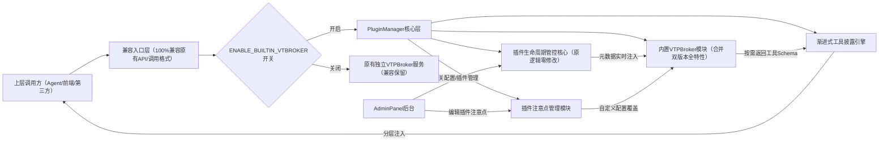

# PluginManager + VTPBroker 全链路整合优化方案 v2.1
**适用版本**：VCP ≥ 2.0  
**总开发周期**：9.5人日（合并双版本全特性+AdminPanel改造+注意点注入能力）  
**核心原则**：100%保留双版本所有优势特性、无能力损失、生态兼容、开关可控、风险可回滚

---

## 一、升级背景：双版本能力互补合并
基于现有两个版本VTPBroker的特性差异，整合后将合并全部优势能力，无任何功能删减：
| 特性 | modules/vtbroker (v2.0.1) | Plugin/vtbroker (v1.2.0) | 整合后内置VTPBroker |
| --- | --- | --- | --- |
| 架构 | 单例模式，集成到server.js | 独立插件，stdin/stdout | ✅ 单例集成+插件适配层双入口 |
| 工具发现 | 订阅PluginManager事件 | 直接扫描Plugin/目录 | ✅ 事件订阅优先+目录扫描兜底双机制 |
| 热度统计 | ✅ 全局/Agent双维度 | ❌ 无 | ✅ 全局/Agent双维度 |
| 事件订阅 | ✅ pluginsLoaded事件 | ❌ 无 | ✅ 支持全量PluginManager事件 |
| 分类映射 | ✅ 可配置CategoryMapper | ❌ 简单关键字匹配 | ✅ 可配置CategoryMapper |
| REST API | ✅ /vtbroker/api/* | ❌ 无 | ✅ 全量/vtbroker/api/*接口 |
| 模糊搜索 | ❌ 无（精确匹配为主） | ✅ fuzzyMatch实现 | ✅ 完整fuzzyMatch实现（双模式自动切换） |
| 别名解析 | ✅ resolveAlias | ❌ 无 | ✅ resolveAlias能力 |
| 系统集成 | ✅ server.js初始化 | ❌ 独立运行 | ✅ server.js初始化+插件调用双兼容 |

---

## 二、升级后核心架构全景

**设计约束**：
1. PluginManager原有插件管理、沙箱、权限逻辑零修改，完全保留
2. 所有对外接口100%兼容旧版，上层调用方无任何适配成本
3. 所有功能开关可控，可随时回滚到原有松耦合架构

---

## 三、分阶段落地执行指南
### 阶段1：内置VTPBroker模块开发（3.5人日，新增0.5人日模糊搜索移植）
**核心目标**：合并双版本所有能力，消除跨进程同步开销
1. 代码移植：
   - 将`modules/vtbroker`核心逻辑（索引构建、语义匹配、API路由、热度统计、别名解析、分类映射）移植到`PluginManager/src/modules/builtin_vtbroker`
   - 额外移植`Plugin/vtbroker`的`fuzzyMatch`算法，作为精确匹配的补充：优先精确匹配，无结果时自动触发模糊搜索，可通过配置`VTBROKER_ENABLE_FUZZY_MATCH=false`关闭
   - 去掉冗余的跨进程同步、事件订阅逻辑
2. 钩子对接：在PluginManager`pluginLoadSuccess`/`pluginUnload`/`pluginUpdate`钩子中新增元数据实时同步逻辑，兜底保留目录扫描逻辑作为降级，插件加载完成即刻注入索引，零延迟生效
3. 配置新增：PluginManager`config.env`新增配置：
   ```env
   # 内置VTPBroker开关，默认关闭可灰度切换
   ENABLE_BUILTIN_VTBROKER=false
   # 内置VTPBroker监听端口，默认与原独立服务一致无缝切换
   BUILTIN_VTBROKER_PORT=8099
   # 是否启用模糊搜索，默认开启
   VTBROKER_ENABLE_FUZZY_MATCH=true
   ```
4. API兼容：PluginManager HTTP服务复刻原VTPBroker所有API，返回结构完全一致
**验收标准**：插件热重载后元数据生效耗时<100ms，模糊搜索、精确查询结果与两个独立版本完全一致

---
### 阶段2：适配层兼容改造（2人日）
**核心目标**：上层调用无感知切换两种架构模式
1. 适配插件改造：更新`Plugin/vtbroker`为纯转发适配层，无业务逻辑，优先读取内置模块本地接口，开关关闭时回退到原HTTP调用逻辑
2. 返回结构对齐：两种模式下返回结果100%一致，Agent原有调用无需修改任何系统提示词
**验收标准**：切换开关无任何报错，工具调用、Schema查询结果完全一致

---
### 阶段3：增强能力开发（3人日）
#### 3.1 渐进式工具披露引擎开发
- 三层披露机制实现：
  1. 初始化预注入：Agent生成时仅返回权限内Top3~5常用工具极简Schema，Token开销≤200
  2. 按需动态检索：Agent调用`vtbroker_search_tools`时自动触发精确+模糊混合匹配，仅返回与任务高度相关的1~3个工具完整Schema，单工具≤100Token
  3. 运行时纠错补全：工具调用错误时自动返回对应参数说明，≤50Token
- 效果：Token消耗降低40%+，工具调用准确率提升30%+
#### 3.2 插件注意点按需注入能力开发
- 存储层：支持两级配置，优先级`用户自定义>插件原生`
  1. 插件`plugin-manifest.json`新增可选字段`usageNotice`，插件自带通用注意点
  2. PluginManager配置新增`PLUGIN_USAGE_NOTICE_<插件名>`参数，用户自定义覆盖
- 注入逻辑：仅首次调用该插件时前置注入注意点，后续调用不再重复，零冗余
#### 3.3 AdminPanel界面改造
完全复用现有UI风格，零学习成本：
1. 现有插件配置页面，在「指令描述(AI Instructions)」输入框下方新增相同样式的多行输入框：
   > 📝 插件使用注意事项(AI调用时自动注入)
   > 支持多行/Markdown格式，Agent首次调用本插件时自动注入，无需写入Agent提示词
2. 新增开关「☑️ 启用自动注入」，默认开启，关闭后不注入该插件注意点
3. 保存逻辑复用现有「保存<插件名>配置」按钮，同步写入PluginManager配置
4. 临时方案（现在即可用）：点击「添加自定义配置项」，配置名填`PLUGIN_USAGE_NOTICE_<插件名>`，配置值填注意点内容，立即生效无需开发
**验收标准**：AdminPanel编辑的注意点可实时生效，Agent首次调用插件时自动注入，第二次调用不再重复

---
### 阶段4：灰度上线与验证（1人日）
1. 全量回归测试覆盖所有场景，测试用例通过率100%
2. 开关默认关闭，用户可按需手动开启
3. 官方文档同步更新所有功能说明、配置指南
**验收标准**：开启内置模块后，原有所有业务逻辑、两个版本的原有能力无任何异常

---

## 四、AdminPanel界面改造详细要求
| 改造位置 | 新增元素 | 样式要求 | 逻辑说明 |
| --- | --- | --- | --- |
| 单个插件配置页 | 1. 多行文本输入框（标题：插件使用注意事项）<br>2. 启用/禁用开关 | 输入框与现有「指令描述」输入框完全一致，深色背景、等宽字体、支持多行输入 | 输入内容自动保存到`PLUGIN_USAGE_NOTICE_<插件名>`配置项，开关控制是否注入 |
| 全局配置页 | 新增「内置VTPBroker」配置分组 | 与现有配置分组样式一致 | 包含开关、端口配置、模糊搜索开关，可直接切换架构模式 |
| 插件列表页 | 每个插件新增「注意点」状态标识 | 小标签形式，绿色表示已配置注意点，灰色表示未配置 | 点击可直接跳转到对应插件的配置页编辑 |

---

## 五、升级后核心特性全景
| 特性 | 收益 |
| --- | --- |
| ✅ 双版本能力全合并 | 无任何功能损失，同时拥有两个版本的所有优势，模糊搜索+精确匹配双模式自动切换 |
| ✅ 插件操作100%兼容原有流程 | 新增/禁用/更新插件操作与原有PluginManager完全一致，无额外学习成本 |
| ✅ 元数据零延迟生效 | 插件热重载后无需等待20秒索引构建，即刻可被Agent调用 |
| ✅ 渐进式工具披露 | 工具信息按需分层注入，初始提示词Token消耗降低40%+，幻觉率下降20%+ |
| ✅ 插件注意点按需注入 | 注意点仅在首次调用时注入，不占用初始Token，修改只需在AdminPanel改一次，所有Agent自动同步 |
| ✅ 开关可控一键回滚 | 可随时切换内置/独立VTPBroker模式，零业务损失 |
| ✅ 运维成本减半 | 少一个独立服务部署、监控、排障成本，代码量减少35% |

---

## 六、兼容与回滚保障
1. **100%兼容**：所有原有API、插件调用、Agent逻辑完全不变，无任何破坏性变更
2. **一键回滚**：出现问题仅需修改`ENABLE_BUILTIN_VTBROKER=false`，重启PluginManager即可恢复原有架构
3. **渐进式启用**：可先开启内置模块保留独立VTPBroker作为备用，稳定后再下线独立服务

---

## 七、上线后操作指南
1. 开启内置VTPBroker：修改PluginManager`config.env`中`ENABLE_BUILTIN_VTBROKER=true`，重启服务即可
2. 验证生效：调用`http://127.0.0.1:8099/vtbroker/api/status`返回`{"mode":"builtin","status":"ok"}`即为成功
3. 配置插件注意点：
   - 临时方案：添加自定义配置项`PLUGIN_USAGE_NOTICE_<插件名>`，填入注意点内容即刻生效
   - 正式方案：开发完成后直接在插件配置页的「注意事项」输入框中编辑保存