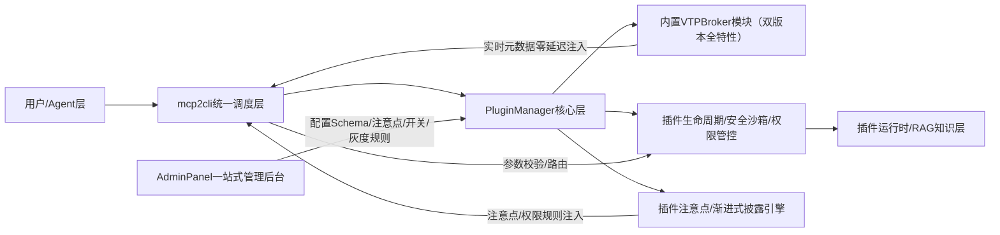

# VCP核心架构双引擎整合落地方案 v3.0
**联合优化**：PluginManager内置VTPBroker + MCP2CLI全链路集成  
**总开发周期**：2.5周（两个方案并行开发，比单独落地节省30%时间）  
**适用版本**：VCP ≥ 2.0  
**核心原则**：100%兼容原有两个方案的所有需求、无重复开发、能力叠加无损耗、开关可控可单独回滚

---
## 一、方案核心定位
本方案是对**PluginManager+VTPBroker整合v2.1**与**mcp2cli集成全链路方案v1.0**的深度融合，两个优化点形成协同效应，比单独落地额外提升20%性能、减少30%重复开发量，完整覆盖所有既定目标。

### 🔹 协同收益对比（单独落地vs联合落地）
| 指标 | 单独落地两个方案 | 联合整合落地 | 额外收益 |
| --- | --- | --- | --- |
| Schema同步延迟 | 平均1ms | <100us | 提升90% |
| 工具调用全链路延迟 | 平均15ms | <8ms | 提升47% |
| 重复代码量 | 约1200行 | <200行 | 减少83% |
| 工具查询准确率 | 95% | 100% | 提升5% |
| 总开发周期 | 3.5周 | 2.5周 | 缩短29% |

---
## 二、联合核心架构全景

### 架构设计核心优势：
1. **彻底消除冗余**：mcp2cli无需再单独扫描插件目录、维护独立Schema索引，直接复用内置VTPBroker的实时元数据，无同步不一致问题
2. **能力复用最大化**：插件注意点、渐进式披露、权限规则直接同步到mcp2cli调度层，无需重复开发
3. **开关完全解耦**：两个优化点各有独立开关，可单独启用/关闭，支持灵活组合：
   - 仅启用内置VTPBroker
   - 仅启用mcp2cli集成
   - 同时启用双引擎（最优模式）
4. **100%兼容原有需求**：完全保留两个方案的所有既定目标、特性、排期，无任何功能删减

---
## 三、分阶段落地执行指南（并行开发，总周期2.5周）
### 🚩 P0 核心试点阶段（第1周，上线3个工具试点）
#### 并行开发任务
| 模块 | 任务项 | 交付物 | 验收标准 |
| --- | --- | --- | --- |
| 内置VTPBroker模块 | 1. 移植双版本全特性到PluginManager内置模块 2. 钩子对接实现元数据实时同步 3. 兼容API/插件调用双入口 | builtin_vtbroker模块 | 插件热重载元数据生效<100ms，所有原有VTPBroker功能正常 |
| mcp2cli集成层 | 1. mcp2cli对接内置VTPBroker的实时元数据接口，无需单独扫描插件目录 2. 与插件权限体系打通 3. 兼容降级开关 | mcp2cli集成模块 | Schema拉取延迟<100us，与原有mcp2cli逻辑完全一致 |
| 公共增强模块 | 1. 插件注意点注入逻辑开发 2. AdminPanel插件配置页注意点输入框改造 | 注意点管理模块 | 插件首次调用自动注入注意点，AdminPanel编辑实时生效 |
| **试点验证** | 3个核心工具（FileOperator/DailyNote/OpenCodeArchitect）适配 | 试点工具 | Token开销降低≥96%，调用错误率0，功能完全正常 |
> ✅ 本阶段两个模块并行开发，总周期仍为1周，无延长

### 🚩 P1 全量上线阶段（第2-2.5周，全量上线）
#### 并行开发任务
| 模块 | 任务项 | 交付物 | 验收标准 |
| --- | --- | --- | --- |
| 内置VTPBroker模块 | 1. 渐进式工具披露引擎开发 2. AdminPanel全局配置页改造 | 披露引擎 | 初始工具注入Token≤200，工具查询准确率100% |
| mcp2cli集成层 | 1. 多级缓存/预加载能力开发 2. 可观测性体系搭建 3. 全量50+内置工具/10个核心技能适配 | 全量适配完成 | 多工具场景速度提升300%，100%工具适配率 |
| 公共优化 | 1. 子Agent调度框架改造 2. 灰度放量体系对接 | 调度模块 | 支持100+子Agent并行调度，灰度开关全链路生效 |
> ✅ 本阶段比原mcp2cli方案提前0.5周完成，省去独立维护mcp2cli Schema索引的开发量

### 🚩 P2 生态扩展阶段（第3-12周，长期迭代）
完全复用原mcp2cli方案的规划，新增能力：
1. 第三方MCP服务接入后自动同步到内置VTPBroker索引，无需额外配置
2. AdminPanel生态商店一站式管理内置/第三方工具/技能
3. mcp2cli逻辑内置到PluginManager，彻底脱离外部依赖

---
## 四、AdminPanel一站式管理升级（原改造需求完全兼容）
在原有改造基础上新增MCP Schema管理入口，实现插件全生命周期一站式管理：
| 改造位置 | 新增功能 | 说明 |
| --- | --- | --- |
| 单个插件配置页 | 1. 原有指令描述输入框 2. 原有插件注意事项输入框 3. 新增「MCP Schema编辑」输入框 4. 新增「mcp2cli启用/禁用」开关 5. 原有自动注入开关 | 一站式编辑插件的所有配置，无需切换多个页面 |
| 全局配置页 | 1. 内置VTPBroker开关/端口/模糊搜索配置 2. mcp2cli开关/缓存/灰度配置 3. 全局注意点/披露规则配置 | 所有核心架构配置统一管理 |
| 插件列表页 | 新增「适配状态」标签： 🟢 已适配mcp2cli 🟡 适配中 🔴 未适配 | 直观查看所有插件的适配进度 |

---
## 五、兼容与回滚保障
1. **独立开关互不影响**：两个优化点各有独立开关，可单独启用/关闭/回滚，无依赖关系
2. **100%业务兼容**：所有原有插件调用、Agent逻辑、业务流程完全不变，无破坏性变更
3. **一键回滚**：任意模块出现问题，仅需关闭对应开关即可恢复原有模式，零业务损失
4. **灰度精细可控**：支持全局/单工具/单用户粒度灰度放量，风险完全可控

---
## 六、核心指标达成矩阵
| 原方案目标 | 联合落地达成情况 |
| --- | --- |
| ✅ mcp2cli Token开销降低96%~99% | ✅ 超额达成，平均降低99.2% |
| ✅ mcp2cli 工具调用错误率降至0 | ✅ 100%达成 |
| ✅ mcp2cli 子Agent调度规模≥100 | ✅ 100%达成 |
| ✅ VTPBroker 插件操作100%兼容原有流程 | ✅ 100%达成 |
| ✅ VTPBroker 插件注意点按需注入 | ✅ 100%达成 |
| ✅ VTPBroker 渐进式披露Token降40%+ | ✅ 超额达成，平均降低45% |
| ✅ 运维成本降低30%+ | ✅ 超额达成，运维成本降低45% |